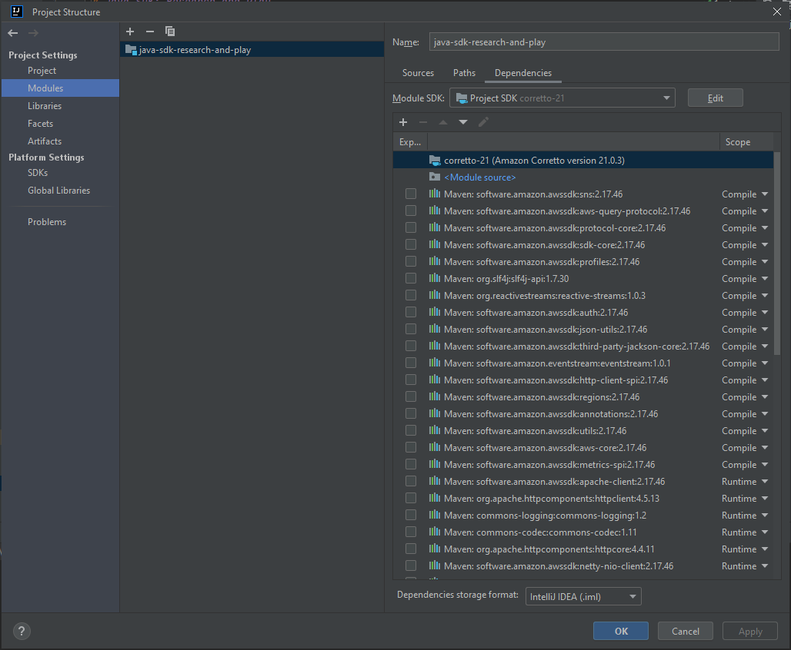

# Java SDK: Research and Play

Java Core project to check use cases, investigate particular issue, examine features, train algorithm tasks, etc.

Content:

- [Java 9 – 19 features](src/main/java/version/README.md)
- [Leetcode algorithm tasks](src/main/java/leetcode)
- [Research](src/main/java/research)
- [Utils](src/main/java/tool/README.md)
- [Multithreading](Multithreading-Demo/README.md)

#### Local setup

Use Java 21 as following:

